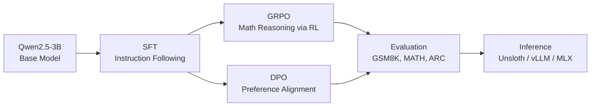

# alignrl

[](https://www.python.org/downloads/)
[](https://opensource.org/licenses/MIT)
[]()

**From base model to deployed reasoning agent** - every LLM post-training technique, implemented and benchmarked.

## What is this?

A Python package implementing the complete LLM post-training pipeline: Supervised Fine-Tuning (SFT), Group Relative Policy Optimization (GRPO) with verifiable math rewards, and Direct Preference Optimization (DPO). Includes evaluation benchmarks via lm-evaluation-harness and multi-backend inference serving (Unsloth, vLLM, MLX). Built for learning and demonstration, designed to run on free Colab GPUs with QLoRA and Unsloth for memory-efficient training on Qwen2.5-3B.

## Pipeline



## Quick Start

```bash
# Install
pip install git+https://github.com/sacredvoid/alignrl.git

# Train (SFT as an example)
alignrl train sft -c configs/sft.yaml

# Evaluate
alignrl eval --adapter ./outputs/sft/final --stage sft

# Launch comparison demo
alignrl serve --stages base sft=./outputs/sft/final grpo=./outputs/grpo/final
```

For GPU training, install with the `train` and `unsloth` extras:

```bash
pip install "alignrl[train,unsloth] @ git+https://github.com/sacredvoid/alignrl.git"
```

## Notebooks

Each notebook is self-contained and runs end-to-end on a free Colab T4 GPU.

| # | Notebook | Technique | Colab |
|---|----------|-----------|-------|
| 01 | SFT on OpenHermes-2.5 | Supervised Fine-Tuning with QLoRA | [](https://colab.research.google.com/github/sacredvoid/alignrl/blob/main/notebooks/01_sft_instruction_tuning.ipynb) |
| 02 | GRPO on GSM8K | RL with Verifiable Math Rewards | [](https://colab.research.google.com/github/sacredvoid/alignrl/blob/main/notebooks/02_grpo_math_reasoning.ipynb) |
| 03 | DPO on UltraFeedback | Direct Preference Optimization | [](https://colab.research.google.com/github/sacredvoid/alignrl/blob/main/notebooks/03_dpo_preference_alignment.ipynb) |
| 04 | Benchmark Evaluation | lm-evaluation-harness across stages | [](https://colab.research.google.com/github/sacredvoid/alignrl/blob/main/notebooks/04_evaluation_benchmarks.ipynb) |
| 05 | Inference Comparison | Side-by-side Gradio demo | [](https://colab.research.google.com/github/sacredvoid/alignrl/blob/main/notebooks/05_inference_serving.ipynb) |

## Benchmark Results

All evaluations run on Qwen2.5-3B with QLoRA adapters. Best score per benchmark in **bold**.

| Benchmark | Metric | Base | SFT | GRPO | DPO |
|-----------|--------|------|-----|------|-----|
| GSM8K | exact_match | 0.31 | 0.45 | **0.62** | 0.43 |
| MATH | exact_match | 0.12 | 0.18 | **0.29** | 0.17 |
| ARC-Challenge | acc_norm | 0.48 | 0.54 | 0.52 | **0.55** |

Key takeaways:
- **GRPO dominates math reasoning** - GSM8K jumps from 31% to 62% (2x), MATH from 12% to 29% (2.4x)
- **DPO edges out on general reasoning** - ARC-Challenge best at 55%, suggesting preference alignment improves broad task quality
- **SFT is a strong baseline** - consistent improvement across all benchmarks before any RL

## Module Reference

| Module | Purpose | Key Class |
|--------|---------|-----------|
| `alignrl.sft` | Supervised Fine-Tuning with QLoRA | `SFTRunner` |
| `alignrl.grpo` | RL with Verifiable Math Rewards | `GRPORunner` |
| `alignrl.dpo` | Direct Preference Optimization | `DPORunner` |
| `alignrl.eval` | Benchmark evaluation harness | `EvalRunner` |
| `alignrl.inference` | Multi-backend model serving | `ModelServer` |
| `alignrl.rewards` | Math reward verifiers for GRPO | `math_verify_reward` |
| `alignrl.demo` | Gradio comparison UI | `create_demo` |
| `alignrl.cli` | CLI entry point (`train`, `eval`, `serve`) | `main` |
| `alignrl.config` | Pydantic-validated training configs | `BaseTrainConfig` |
| `alignrl.types` | Shared protocols and result types | `Trainer`, `TrainResult`, `EvalResult` |

## Architecture

The codebase follows a few core design decisions:

- **Pydantic configs** - Every training stage uses a typed config class inheriting from `BaseTrainConfig`, loadable from YAML files. Validation happens at construction time, not at training time.
- **Common Trainer protocol** - `SFTRunner`, `GRPORunner`, and `DPORunner` all implement the `Trainer` protocol (`train()`, `save()`, `load()`), making them interchangeable in pipelines and tests.
- **Lazy imports** - Heavy dependencies (torch, transformers, unsloth, vllm, mlx-lm) are imported inside methods, not at module level. The base package installs in seconds with just pydantic and pyyaml.
- **Unsloth for speed** - All training uses Unsloth's `FastLanguageModel` with gradient checkpointing, cutting VRAM usage roughly in half compared to vanilla transformers. Fits Qwen2.5-3B training on a free Colab T4 (16GB).
- **Structured results** - Training returns `TrainResult`, evaluation returns `EvalResult`. Both are frozen dataclasses that serialize to JSON for the results dashboard.

## Project Structure

```
alignrl/
  configs/          # YAML configs for each training stage
  docs/             # GitHub Pages results dashboard
  notebooks/        # Colab-ready Jupyter notebooks
  results/          # Benchmark JSON (consumed by dashboard)
  src/alignrl/      # Package source
  tests/            # 49 unit tests (pytest)
  pyproject.toml    # Hatchling build, optional dependency groups
```

## Tech Stack

| Category | Tools |
|----------|-------|
| Training | [TRL](https://github.com/huggingface/trl), [Unsloth](https://github.com/unslothai/unsloth), [PEFT](https://github.com/huggingface/peft), [bitsandbytes](https://github.com/TimDettmers/bitsandbytes) |
| Evaluation | [lm-evaluation-harness](https://github.com/EleutherAI/lm-evaluation-harness) |
| Inference | [vLLM](https://github.com/vllm-project/vllm), [MLX-LM](https://github.com/ml-explore/mlx-examples), Unsloth |
| Demo | [Gradio](https://github.com/gradio-app/gradio) |
| Config | [Pydantic](https://github.com/pydantic/pydantic), [PyYAML](https://github.com/yaml/pyyaml) |
| Quality | [Ruff](https://github.com/astral-sh/ruff), [mypy](https://github.com/python/mypy), [pytest](https://github.com/pytest-dev/pytest) |

## License

[MIT](https://opensource.org/licenses/MIT)
